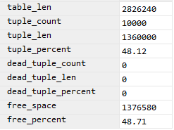
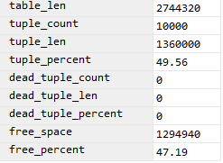
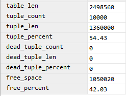
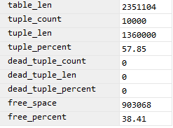

## Fillfactor

#### scripts:
- [create](create.sql)
- [insert](insert.sql)
- [update](update.sql)

### Analysis
```sql
UPDATE f100 SET text = text || text;
```

|   Fillfactor    |    50   |     75  |    90   |    100   |
|:----:|:----:|:----:|:----:|:----:
|   **Update time 1** |  63ms   |  63ms  |   62ms  |  70ms   |
|   **Update time 2** |  43ms   |  64ms  |   50ms  |  44ms   |
|   **Update time 3** |  46ms   |  43ms  |   159ms  |  54ms   |
|   **Update time 4** |  48ms   | 116ms  |   51ms  |  222ms   |
|   **Update time 5** |  45ms   |  53ms  |   41ms  |  40ms   |
|   **AVG**           |  49ms   |  67.7ms  |   72.6ms  |  86ms   |

```sql
SELECT * FROM pgstattuple(17937);
SELECT * FROM pgstattuple(17940);
SELECT * FROM pgstattuple(17943);
SELECT * FROM pgstattuple(17946);
```
|   50    |     75  |
|:---:|:---:|
|      |       |


|    90   |    100   |
|:---:|:---:|
|       |       |
