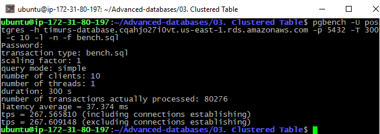

# 03. Clustered Table
 
 ### flyway script
 + [V11.1__LAB3_create_table_for_custerization.sql](../flyway-6.4.1/sql/V11.1__LAB3_create_table_for_custerization.sql)
 + [V11.2__LAB3_generate_rows_for_cluster_table.sql](../flyway-6.4.1/sql/V11.2__LAB3_generate_rows_for_cluster_table.sql)
 + [V11.3__LAB3_clusterize_table.sql](../flyway-6.4.1/sql/V11.3__LAB3_clusterize_table.sql)

 ### bench scripts
 + [bench.sql](bench.sql)
 

### benchmarking without clusterization

migrate to `11.2`
 
```bash
pgbench -U postgres -h timurs-database.cqahjo27i0vt.us-east-1.rds.amazonaws.com -p 5432 -T 300 -c 10 -l -n -f bench.sql
``` 


### benchmarking with clusterization

migrate to `11.3`

```bash
pgbench -U postgres -h timurs-database.cqahjo27i0vt.us-east-1.rds.amazonaws.com -p 5432 -T 300 -c 10 -l -n -f bench.sql
``` 


### Вывод

|  |  latency | tps |
|:-----:|:--------:|:---:|
| without clusterization |  37.374 ms | 267 |
| with clusterization   |  38.194 ms| 261  |

