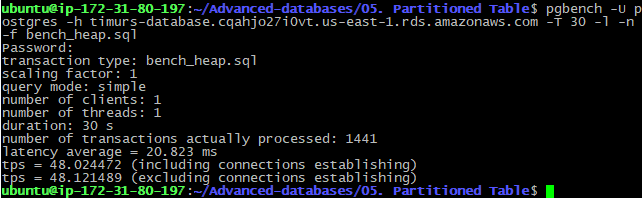
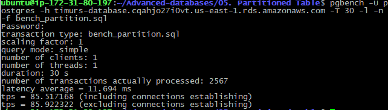
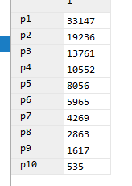

# 5. Partitioned Table
 
 ### flyway script
 + [V13.1__LAB5_create_partition_table.sql](../flyway-6.4.1/sql/V13.1__LAB5_create_partition_table.sql)
 + [V13.2__LAB5_insert_into_partition_table.sql](../flyway-6.4.1/sql/V13.2__LAB5_insert_into_partition_table.sql)

 ## benchmarking

 ### heap table

```bash
pgbench -U postgres -h timurs-database.cqahjo27i0vt.us-east-1.rds.amazonaws.com -T 30 -l -n -f bench_heap.sql
```



 ### partition table

```bash
pgbench -U postgres -h timurs-database.cqahjo27i0vt.us-east-1.rds.amazonaws.com -T 30 -l -n -f bench_partition.sql
```
 


## partition distribution

```sql
SELECT
       (SELECT count(1) FROM partition_table_1) as p1,
       (SELECT count(1) FROM partition_table_2) as p2,
       (SELECT count(1) FROM partition_table_3) as p3,
       (SELECT count(1) FROM partition_table_4) as p4,
       (SELECT count(1) FROM partition_table_5) as p5,
       (SELECT count(1) FROM partition_table_6) as p6,
       (SELECT count(1) FROM partition_table_7) as p7,
       (SELECT count(1) FROM partition_table_8) as p8,
       (SELECT count(1) FROM partition_table_9) as p9,
       (SELECT count(1) FROM partition_table_10) as p10;
```




## Вывод

#### TPS
+ heap: 48
+ partition: 85

#### latency
+ heap: 20 ms
+ partition: 11 ms


