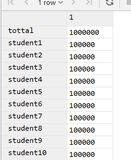
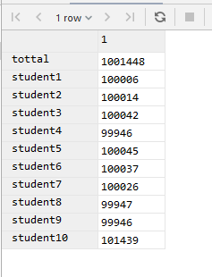
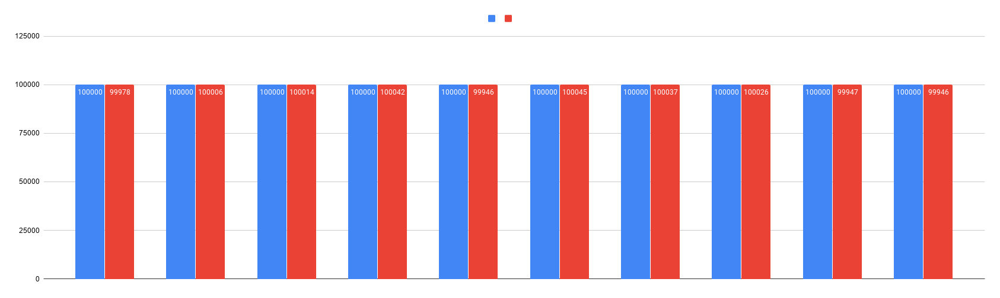

# 6. Inherited Table

### flyway scripts
+ [V3.1__LAB6_create_inherited_tables.sql](../flyway-6.4.1/sql/V3.1__LAB6_create_inherited_tables.sql)
+ [V3.2__LAB6_create_distribution_rules.sql](../flyway-6.4.1/sql/V3.2__LAB6_create_distribution_rules.sql)
+ [V3.3__LAB6_insert_into_hub.sql](../flyway-6.4.1/sql/V3.3__LAB6_insert_into_hub.sql)
+ [V3.4__LAB6_create_redistribution_rules.sql](../flyway-6.4.1/sql/V3.4__LAB6_create_redistribution_rules.sql)

### distribution before bulk update

```sql
SELECT
    (SELECT count(id) FROM student_hub) as tottal,
    (SELECT count(id) FROM student1) as student1,
    (SELECT count(id) FROM student2) as student2,
    (SELECT count(id) FROM student3) as student3,
    (SELECT count(id) FROM student4) as student4,
    (SELECT count(id) FROM student5) as student5,
    (SELECT count(id) FROM student6) as student6,
    (SELECT count(id) FROM student7) as student7,
    (SELECT count(id) FROM student8) as student8,
    (SELECT count(id) FROM student9) as student9,
    (SELECT count(id) FROM student10) as student10
```



### distribution after bulk update

```bash
pgbench -U postgres -h timurs-database.cqahjo27i0vt.us-east-1.rds.amazonaws.com -p 5432 -T 300 -l -n -f bulk_update.sql -D id1=0 -D id2=999999
```






Получилось что при большой нагрузке видимо происходят какие-то коллизии и строки дублируются. 
Могу предположить что это происходит из-за того, что рулы не успевают отрабатывать, 
и в этот момент на ту же строку поступает еще один апдейт. А может я не правильно рулы прописал...   

