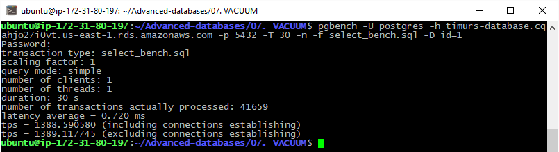
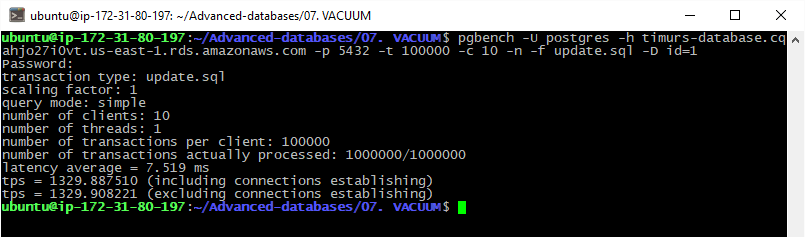
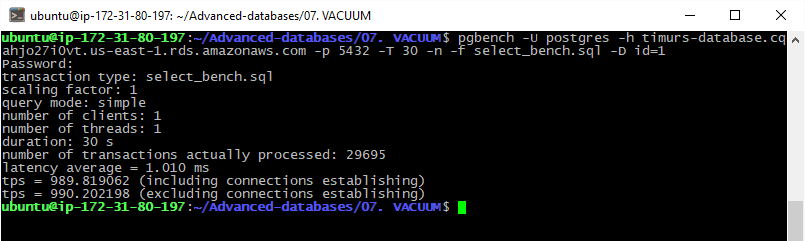
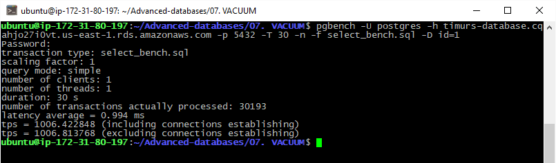
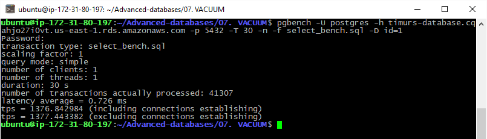

# 07. VACUUM

### flyway scripts
+ [V4.1__LAB7_cteate_table.sql](../flyway-6.4.1/sql/V4.1__LAB7_cteate_table.sql)

### benchmark script
+ [select_bench.sql](select_bench.sql)

## 1. first benchmark
 
 ```sql
SELECT pg_size_pretty(pg_total_relation_size('lab7')); 

-- returned 16 kB
```

```bash
pgbench -U postgres -h timurs-database.cqahjo27i0vt.us-east-1.rds.amazonaws.com -p 5432 -T 30 -n -f select_bench.sql -D id=1
```


## 2. after 1kk updates

```bash
pgbench -U postgres -h timurs-database.cqahjo27i0vt.us-east-1.rds.amazonaws.com -p 5432 -t 100000 -c 10 -n -f update.sql -D id=1
```



 ```sql
SELECT pg_size_pretty(pg_total_relation_size('lab7')); 

-- returned 6352 kB
```

```bash
pgbench -U postgres -h timurs-database.cqahjo27i0vt.us-east-1.rds.amazonaws.com -p 5432 -T 30 -n -f select_bench.sql -D id=1
```



## 3. after VACUUM

 ```sql
VACUUM lab7;
SELECT pg_size_pretty(pg_total_relation_size('lab7')); 

-- returned 6360 kB
```

```bash
pgbench -U postgres -h timurs-database.cqahjo27i0vt.us-east-1.rds.amazonaws.com -p 5432 -T 30 -n -f select_bench.sql -D id=1
```




## 4. after VACUUM FULL

 ```sql
VACUUM FULL VERBOSE lab7;
--"lab7": found 0 removable, 1 nonremovable row versions in 790 pages

SELECT pg_size_pretty(pg_total_relation_size('lab7')); 
-- returned 16 kB
```

```bash
pgbench -U postgres -h timurs-database.cqahjo27i0vt.us-east-1.rds.amazonaws.com -p 5432 -T 30 -n -f select_bench.sql -D id=1
```



## Итого

| step | tps |
|:---:|:---:|
| one row | 1389 |
| 1kk updates | 990 |
| VACUUM | 1006 |
| VACUUM FULL | 1377 |

