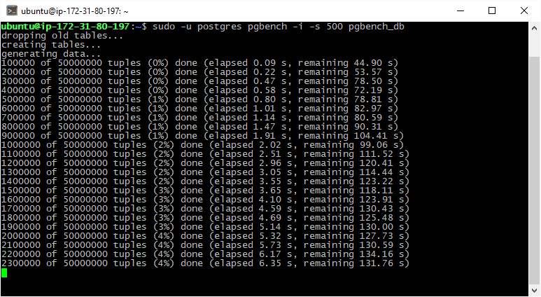

# PgBadger

#### Preparing DB for TBC-B test 

+ install pgBadger
+ set postgres [log config](postgres_log.conf)
+ reload postgres
+ init `pgbench_db`

```bash
sudo -u postgres pgbench -i -s 500 pgbench_db
```

#### Executing TBC-B test 

```bash
sudo -u postgres pgbench -c 100 -s 500 -T 15 pgbench_db
```


#### pgBadger report

+ [remote on EC2](http://ec2-54-152-89-25.compute-1.amazonaws.com/out.html)
+ [saved html in rep](pgBadger_out.html)

#### Place for my explanation

1. Update запросы исполняются значительно медленне чем Insert
1. 


