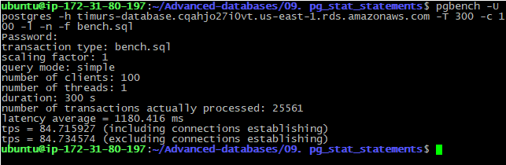
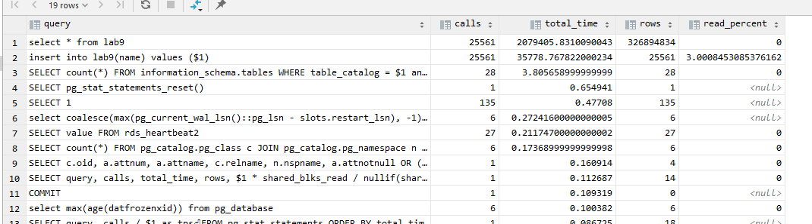
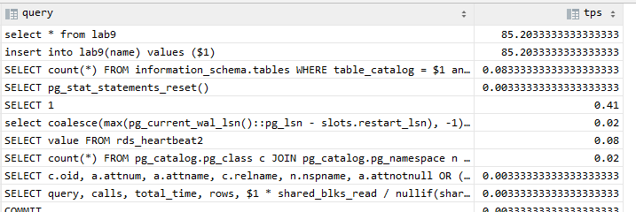

# 09. pg_stat_statements

Устанавливаем расширение, создаем тестовую таблицу

```sql
CREATE EXTENSION pg_stat_statements;
CREATE TABLE lab9 (
    name varchar
);
```

Добавляем строку в конфиг постгреса
```bash 
echo "shared_preload_libraries = 'pg_stat_statements'" >> postgresql.conf
```

Сбрасываем статистику
```sql
SELECT pg_stat_statements_reset();
```

Запускаем бенч скрипт
```bash
pgbench -U postgres -h timurs-database.cqahjo27i0vt.us-east-1.rds.amazonaws.com -T 300 -c 100 -l -n -f bench.sql
```


## Top 20 queries and read_percent
```sql
SELECT query, calls, total_time, rows, 100.0 * shared_blks_read / nullif(shared_blks_hit + shared_blks_read, 0) AS read_percent
FROM pg_stat_statements ORDER BY total_time DESC LIMIT 20;
```



## TPS

```sql
SELECT query, calls / 300.0 as tps
FROM pg_stat_statements ORDER BY total_time DESC LIMIT 20;
```




