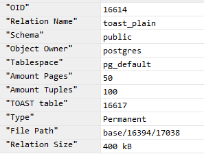
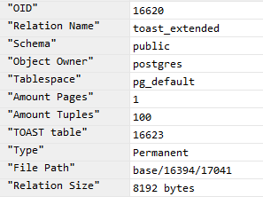
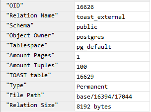
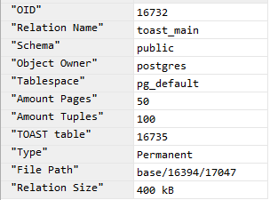
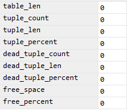
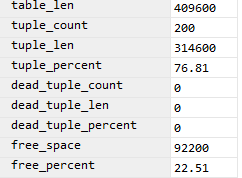
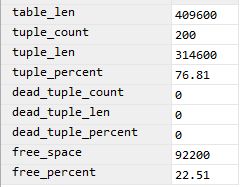
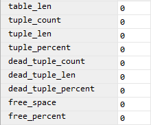
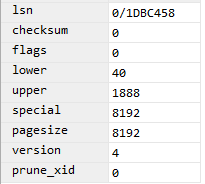
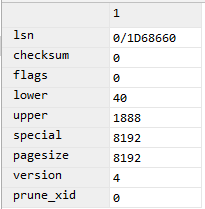

Tasks: https://docs.google.com/document/d/1-zWB_upVSt1fB_Vz1FA0SoaNoT_ewUZHraarHJRiqiM/edit

# 1. Compare all possible TOAST strategies for column with type VARCHAR / TEXT

 + [database scripts to create / change DB tables](./toast_strategies.sql)
 
 ### Original Tables Info
   | Plain  | Extended |
|:-------:|:--------:|
  |    |    | 
  
  | External |  Main  |
 |:--------:|:------:|
  |   |    |
 
### TOAST Info

```sql
SELECT * FROM pgstattuple(16626);
```

| Plain  | Extended |
|:-------:|:--------:|
|    |    | 

| External |  Main  |
|:--------:|:------:|
|   |    |

### Toast first page header

| Extended  | External |
|:-------:|:--------:|
|    |    | 

- Plain and Main don't have any page in TOAST. 
 
 ### Comparason analysis of elapsed time to SELECT data 
 
 | Strategy         | Plain  | Extended | External |  Main  |
 |:---------------:|:-------:|:--------:|:--------:|:------:|
 | **timing avg** |  9.24ms |  8.98ms  |  8.42ms  | 7.02ms |
 
 Amount of tests: `50`.

 
 #### Замечание 1: 
 + Изначально я генерировал строки, состоящие из одного символа. 
 В этом случае таблица со стратегией `extended` не добавляла данные в `TOAST`. 
 Видимо такие строки хорошо сжимаются.
 + В случае же c рандомно сгенерированной строкой 
 таблица со стратегией `extended` добавляет строки в `TOAST`.
 
  #### Замечание 2: 
- Замеры времени брал из DataGrip. 
Так как нам важна разница времени выполнения запросов, а не их скорость. 
- Предположительно psql выполнял запрос в 2 раза быстрее Datagrip
(4ms и 8ms avg соответсвенно. Сравнивал на таблице со стратегией plain).
Думаю такое различие связано с разным типом подключения. 
DataGrip подключается по jdbc.

