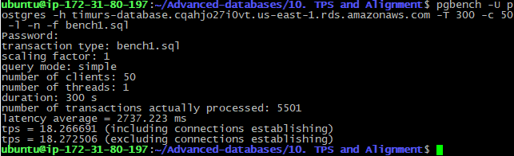
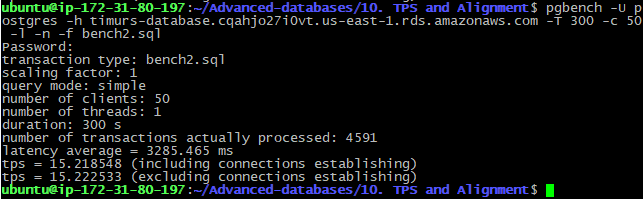
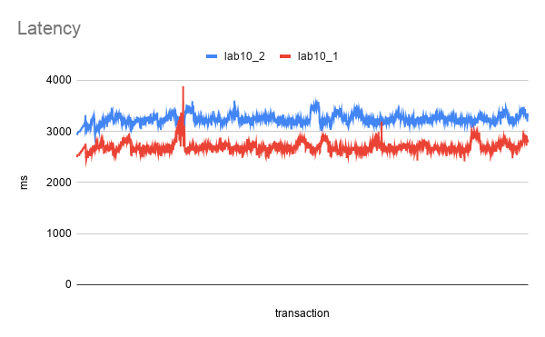

# 10. TPS and Alignment


 ### flyway script
 + [V14.1__LAB10_create_tables.sql](../flyway-6.4.1/sql/V14.1__LAB10_create_tables.sql)


## benchmark scripts
+   [bench1.sql](bench1.sql)
+   [bench2.sql](bench2.sql)

 ## benchmarking
 
 ```bash
pgbench -U postgres -h timurs-database.cqahjo27i0vt.us-east-1.rds.amazonaws.com -T 300 -c 50 -l -n -f bench1.sql
```

 
```bash
pgbench -U postgres -h timurs-database.cqahjo27i0vt.us-east-1.rds.amazonaws.com -T 300 -c 50 -l -n -f bench2.sql
```


### Вывод

#### TPS
+ varchar first: 18
+ varchar last: 15

#### Latency
+ varchar first: 2737 ms
+ varchar last: 3285 ms


