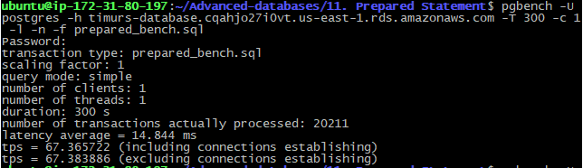
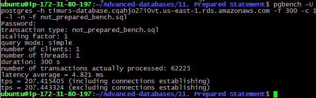

# 11. Prepared Statement


### flyway script
+ [V15.1__create_tables.sql](../flyway-6.4.1/sql/V15.1__create_tables.sql)


## benchmark scripts
+   [prepared_bench.sql](prepared_bench.sql)
+   [not_prepared_bench.sql](not_prepared_bench.sql)

 ## benchmarking
 
 ```bash
pgbench -U postgres -h timurs-database.cqahjo27i0vt.us-east-1.rds.amazonaws.com -T 300 -c 1 -l -n -f prepared_bench.sql
```

 
```bash
pgbench -U postgres -h timurs-database.cqahjo27i0vt.us-east-1.rds.amazonaws.com -T 300 -c 1 -l -n -f not_prepared_bench.sql
```


### Вывод

#### TPS
+ varchar first: 2737 ms
+ varchar last: 18

#### Latency
+ varchar first: 2737 ms
+ varchar last: 15


