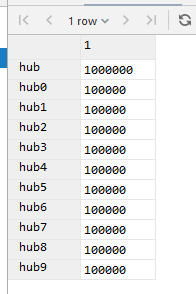
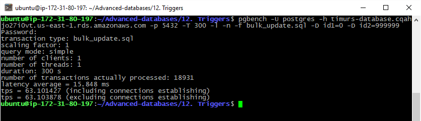
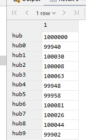
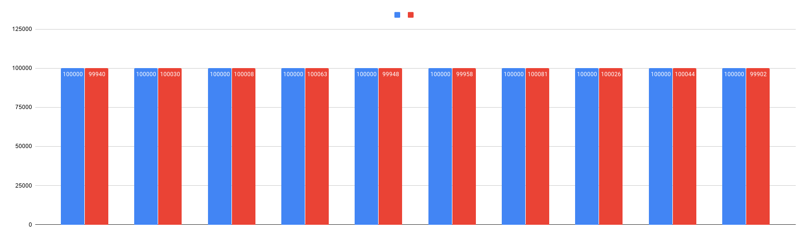

# 12. Triggers

### flyway scripts
+ [V5.1__LAB12_create_table_and_trigger.sql](../flyway-6.4.1/sql/V5.1__LAB12_create_table_and_trigger.sql)
+ [V5.2__LAB12_insert_data.sql](../flyway-6.4.1/sql/V5.2__LAB12_insert_data.sql)

### benchmark scripts
+ [bulk_update.sql](bulk_update.sql)

### before bulk update

```sql
SELECT
    (SELECT count(id) FROM hub) as hub,
    (SELECT count(id) FROM hub_inherit_0) as hub0,
    (SELECT count(id) FROM hub_inherit_1) as hub1,
    (SELECT count(id) FROM hub_inherit_2) as hub2,
    (SELECT count(id) FROM hub_inherit_3) as hub3,
    (SELECT count(id) FROM hub_inherit_4) as hub4,
    (SELECT count(id) FROM hub_inherit_5) as hub5,
    (SELECT count(id) FROM hub_inherit_6) as hub6,
    (SELECT count(id) FROM hub_inherit_7) as hub7,
    (SELECT count(id) FROM hub_inherit_8) as hub8,
    (SELECT count(id) FROM hub_inherit_9) as hub9;
```


### after bulk update

```bash
pgbench -U postgres -h timurs-database.cqahjo27i0vt.us-east-1.rds.amazonaws.com -p 5432 -T 300 -l -n -f bulk_update.sql -D id1=0 -D id2=999999
```





Все хорошо отработало, в отличии от рулов. 
Жаль только рандом тоже равномерный, поэтому перераспределения не особо видно на графике. (Это можно исправить)

