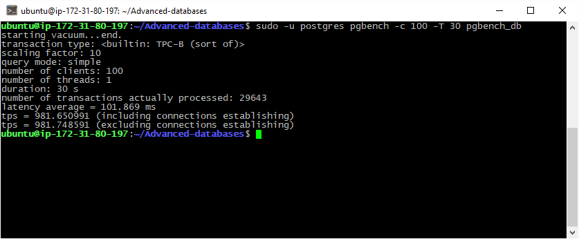
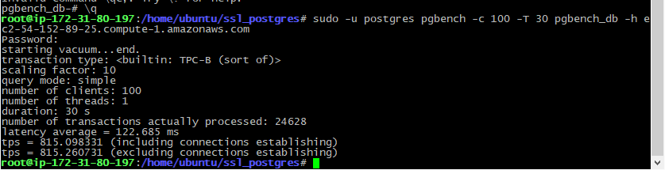

# 15. SSL

#### Init TBC-B test 

```bash
sudo -u postgres pgbench -i -s 10 pgbench_db
```


#### Executing TBC-B test 

```bash
sudo -u postgres pgbench -c 100 -T 30 pgbench_db
```



#### set SSL

my EC2 host: ec2-54-152-89-25.compute-1.amazonaws.com 

```bash
openssl req -new -nodes -text -out root.csr -keyout root.key -subj "/CN=ITIS PostgreSQL Team"

openssl x509 -req -in root.csr -text -days 365 -extfile /etc/ssl/openssl.cnf -extensions v3_ca -signkey root.key -out root.crt

openssl req -new -nodes -text -out server.csr -keyout server.key -subj "ec2-54-152-89-25.compute-1.amazonaws.com"

openssl x509 -req -in server.csr -text -days 365 -CA root.crt -CAkey root.key -CAcreateserial -out server.crt

openssl req -new -nodes -text -out postgresql.csr -keyout postgresql.key -subj "/CN=postgres"

openssl x509 -req -in postgresql.csr -text -days 365 -CA root.crt -CAkey root.key -CAcreateserial -out postgresql.crt

``` 

```bash
# Проверка
 psql -p 5432 "sslmode=require dbname=pgbench_db" -U postgres -h ec2-54-152-89-25.compute-1.amazonaws.com

# Тест
sudo -u postgres pgbench -c 100 -T 30 pgbench_db -h ec2-54-152-89-25.compute-1.amazonaws.com
```



Показатели Latency и TPS ухудшились после включения SSL

