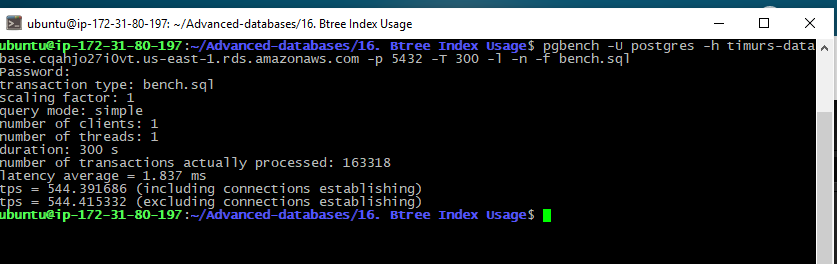
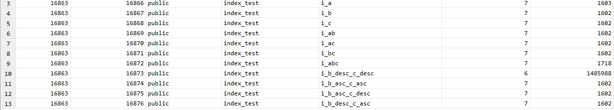

# 16. Btree Index Usage
 
 ### flyway script
 + [V7.2__LAB16_recreate_table_and_indexes.sql](../flyway-6.4.1/sql/V7.2__LAB16_recreate_table_and_indexes.sql)

 ### bench script
 + [bench.sql](bench.sql)

### benchmarking

 
```bash
pgbench -U postgres -h timurs-database.cqahjo27i0vt.us-east-1.rds.amazonaws.com -p 5432 -T 300 -l -n -f bench.sql
```



```sql
SELECT * FROM pg_statio_user_indexes;
```



Число попаданий в буфер для индекса `i_bca` является наибольшим. 
К тому же это в разы больше остальных.
Мне кажется именно этот индекс покрывает запрос.