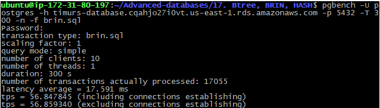

# 17. Btree, BRIN, HASH

### flyway scripts
+ [V17.1__LAB17_create_tables.sql](../flyway-6.4.1/sql/V17.1__LAB17_create_tables.sql)

 ### bench scripts
 + [btree.sql](btree.sql)
 + [hash.sql](hash.sql)
 + [brin.sql](brin.sql)

### indexes size

```sql
select pg_size_pretty( pg_indexes_size('lab17_btree'));
--  2848 kB

select pg_size_pretty( pg_indexes_size('lab17_hash'));
--  4688 kB

select pg_size_pretty( pg_indexes_size('lab17_brin'));
--  48 kB
```

### benchmarking

 
```bash
pgbench -U postgres -h timurs-database.cqahjo27i0vt.us-east-1.rds.amazonaws.com -p 5432 -T 300 -n -f btree.sql
``` 


```bash
pgbench -U postgres -h timurs-database.cqahjo27i0vt.us-east-1.rds.amazonaws.com -p 5432 -T 300 -n -f hash.sql
```


```bash
pgbench -U postgres -h timurs-database.cqahjo27i0vt.us-east-1.rds.amazonaws.com -p 5432 -T 300 -n -f brin.sql
``` 


### Вывод

| index | size      | latency | tps |
|:-----:|:--------:|:---:|:---:|
| btree | 2848 kB | 16.243 ms | 62 |
| hash   | 4688 kB | 9.917 ms| 100  |
| brin  | 48 kB   | 17 ms | 57 |
