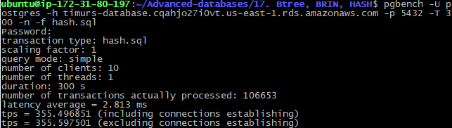

# 17. Btree, BRIN, HASH

### flyway scripts
+ [V17.1__LAB17_create_tables.sql](../flyway-6.4.1/sql/V17.1__LAB17_create_tables.sql)

 ### bench scripts
 + [btree.sql](btree.sql)
 + [hash.sql](hash.sql)
 + [brin.sql](brin.sql)

### indexes size

```sql
select pg_size_pretty( pg_indexes_size('lab17_btree'));
--  5664 kB

select pg_size_pretty( pg_indexes_size('lab17_hash'));
--  4664 kB

select pg_size_pretty( pg_indexes_size('lab17_brin'));
--  48 kB
```

### benchmarking

 
```bash
pgbench -U postgres -h timurs-database.cqahjo27i0vt.us-east-1.rds.amazonaws.com -p 5432 -T 300 -c 10 -n -f btree.sql
``` 


```bash
pgbench -U postgres -h timurs-database.cqahjo27i0vt.us-east-1.rds.amazonaws.com -p 5432 -T 300 -c 10 -n -f hash.sql
```


```bash
pgbench -U postgres -h timurs-database.cqahjo27i0vt.us-east-1.rds.amazonaws.com -p 5432 -T 300 -c 10 -n -f brin.sql
``` 


### Вывод

| index | size      | latency | tps |
|:-----:|:--------:|:---:|:---:|
| btree | 5664 kB | 2.8 ms | 351.8 |
| hash   | 4664 kB | 2.8 ms| 355.6 |
| brin  | 48 kB   | 17.6 ms | 56.8 |
