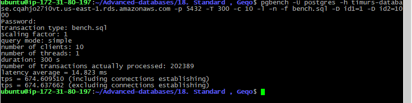

# 18. Standard , Geqo
 
 ### flyway script
 + [V8.1__LAB18_create_tables.sql](../flyway-6.4.1/sql/V8.1__LAB18_create_tables.sql)

 ### bench script
 + [bench.sql](bench.sql)

### check geqo defaults

```sql
SHOW geqo;
--  on
SHOW geqo_threshold;
--  12
```

## geqo off

```sql
SET geqo='off'
```

```bash
pgbench -U postgres -h timurs-database.cqahjo27i0vt.us-east-1.rds.amazonaws.com -p 5432 -T 300 -c 10 -l -n -f bench.sql -D id1=1 -D id2=1000
```


```sql
EXPLAIN ANALYSE VERBOSE
SELECT * FROM lab18_hub
    JOIN lab18_1 ON id = lab18_1.hub_id
    JOIN lab18_2 ON id = lab18_2.hub_id
    JOIN lab18_3 ON id = lab18_3.hub_id
    JOIN lab18_4 ON id = lab18_4.hub_id
    JOIN lab18_5 ON lab18_4.hub_id = hub4_id
WHERE id = 534;
```

```
Nested Loop  (cost=0.00..117.05 rows=1 width=119) (actual time=0.258..0.439 rows=1 loops=1)
  Output: lab18_hub.id, lab18_hub.name, lab18_1.hub_id, lab18_1.name, lab18_2.hub_id, lab18_2.name, lab18_3.hub_id, lab18_3.name, lab18_4.hub_id, lab18_4.name, lab18_5.hub4_id, lab18_5.name
  ->  Nested Loop  (cost=0.00..97.54 rows=1 width=99) (actual time=0.218..0.368 rows=1 loops=1)
        Output: lab18_hub.id, lab18_hub.name, lab18_1.hub_id, lab18_1.name, lab18_2.hub_id, lab18_2.name, lab18_3.hub_id, lab18_3.name, lab18_4.hub_id, lab18_4.name
        ->  Nested Loop  (cost=0.00..78.03 rows=1 width=79) (actual time=0.179..0.300 rows=1 loops=1)
              Output: lab18_hub.id, lab18_hub.name, lab18_1.hub_id, lab18_1.name, lab18_2.hub_id, lab18_2.name, lab18_3.hub_id, lab18_3.name
              ->  Nested Loop  (cost=0.00..58.52 rows=1 width=59) (actual time=0.139..0.227 rows=1 loops=1)
                    Output: lab18_hub.id, lab18_hub.name, lab18_1.hub_id, lab18_1.name, lab18_2.hub_id, lab18_2.name
                    ->  Nested Loop  (cost=0.00..39.01 rows=1 width=39) (actual time=0.094..0.153 rows=1 loops=1)
                          Output: lab18_hub.id, lab18_hub.name, lab18_1.hub_id, lab18_1.name
                          ->  Seq Scan on public.lab18_hub  (cost=0.00..19.50 rows=1 width=19) (actual time=0.051..0.080 rows=1 loops=1)
                                Output: lab18_hub.id, lab18_hub.name
                                Filter: (lab18_hub.id = 534)
                                Rows Removed by Filter: 999
                          ->  Seq Scan on public.lab18_1  (cost=0.00..19.50 rows=1 width=20) (actual time=0.041..0.070 rows=1 loops=1)
                                Output: lab18_1.hub_id, lab18_1.name
                                Filter: (lab18_1.hub_id = 534)
                                Rows Removed by Filter: 999
                    ->  Seq Scan on public.lab18_2  (cost=0.00..19.50 rows=1 width=20) (actual time=0.043..0.073 rows=1 loops=1)
                          Output: lab18_2.hub_id, lab18_2.name
                          Filter: (lab18_2.hub_id = 534)
                          Rows Removed by Filter: 999
              ->  Seq Scan on public.lab18_3  (cost=0.00..19.50 rows=1 width=20) (actual time=0.039..0.071 rows=1 loops=1)
                    Output: lab18_3.hub_id, lab18_3.name
                    Filter: (lab18_3.hub_id = 534)
                    Rows Removed by Filter: 999
        ->  Seq Scan on public.lab18_4  (cost=0.00..19.50 rows=1 width=20) (actual time=0.038..0.067 rows=1 loops=1)
              Output: lab18_4.hub_id, lab18_4.name
              Filter: (lab18_4.hub_id = 534)
              Rows Removed by Filter: 999
  ->  Seq Scan on public.lab18_5  (cost=0.00..19.50 rows=1 width=20) (actual time=0.039..0.069 rows=1 loops=1)
        Output: lab18_5.hub4_id, lab18_5.name
        Filter: (lab18_5.hub4_id = 534)
        Rows Removed by Filter: 999
Planning Time: 0.404 ms
Execution Time: 0.488 ms
```

## geqo on

```sql
SET geqo='on';
SET geqo_threshold=2;
```

```bash
pgbench -U postgres -h timurs-database.cqahjo27i0vt.us-east-1.rds.amazonaws.com -p 5432 -T 300 -c 10 -l -n -f bench.sql -D id1=1 -D id2=1000
```




```sql
EXPLAIN ANALYSE VERBOSE
SELECT * FROM lab18_hub
    JOIN lab18_1 ON id = lab18_1.hub_id
    JOIN lab18_2 ON id = lab18_2.hub_id
    JOIN lab18_3 ON id = lab18_3.hub_id
    JOIN lab18_4 ON id = lab18_4.hub_id
    JOIN lab18_5 ON lab18_4.hub_id = hub4_id
WHERE id = 534;
```

```
Nested Loop  (cost=0.00..117.05 rows=1 width=119) (actual time=0.247..0.425 rows=1 loops=1)
  Output: lab18_hub.id, lab18_hub.name, lab18_1.hub_id, lab18_1.name, lab18_2.hub_id, lab18_2.name, lab18_3.hub_id, lab18_3.name, lab18_4.hub_id, lab18_4.name, lab18_5.hub4_id, lab18_5.name
  ->  Nested Loop  (cost=0.00..97.54 rows=1 width=100) (actual time=0.208..0.356 rows=1 loops=1)
        Output: lab18_1.hub_id, lab18_1.name, lab18_2.hub_id, lab18_2.name, lab18_5.hub4_id, lab18_5.name, lab18_4.hub_id, lab18_4.name, lab18_3.hub_id, lab18_3.name
        ->  Nested Loop  (cost=0.00..78.03 rows=1 width=80) (actual time=0.169..0.288 rows=1 loops=1)
              Output: lab18_1.hub_id, lab18_1.name, lab18_2.hub_id, lab18_2.name, lab18_5.hub4_id, lab18_5.name, lab18_4.hub_id, lab18_4.name
              ->  Nested Loop  (cost=0.00..58.52 rows=1 width=60) (actual time=0.129..0.217 rows=1 loops=1)
                    Output: lab18_1.hub_id, lab18_1.name, lab18_2.hub_id, lab18_2.name, lab18_5.hub4_id, lab18_5.name
                    ->  Nested Loop  (cost=0.00..39.01 rows=1 width=40) (actual time=0.089..0.149 rows=1 loops=1)
                          Output: lab18_1.hub_id, lab18_1.name, lab18_2.hub_id, lab18_2.name
                          ->  Seq Scan on public.lab18_1  (cost=0.00..19.50 rows=1 width=20) (actual time=0.048..0.077 rows=1 loops=1)
                                Output: lab18_1.hub_id, lab18_1.name
                                Filter: (lab18_1.hub_id = 534)
                                Rows Removed by Filter: 999
                          ->  Seq Scan on public.lab18_2  (cost=0.00..19.50 rows=1 width=20) (actual time=0.039..0.069 rows=1 loops=1)
                                Output: lab18_2.hub_id, lab18_2.name
                                Filter: (lab18_2.hub_id = 534)
                                Rows Removed by Filter: 999
                    ->  Seq Scan on public.lab18_5  (cost=0.00..19.50 rows=1 width=20) (actual time=0.039..0.067 rows=1 loops=1)
                          Output: lab18_5.hub4_id, lab18_5.name
                          Filter: (lab18_5.hub4_id = 534)
                          Rows Removed by Filter: 999
              ->  Seq Scan on public.lab18_4  (cost=0.00..19.50 rows=1 width=20) (actual time=0.039..0.069 rows=1 loops=1)
                    Output: lab18_4.hub_id, lab18_4.name
                    Filter: (lab18_4.hub_id = 534)
                    Rows Removed by Filter: 999
        ->  Seq Scan on public.lab18_3  (cost=0.00..19.50 rows=1 width=20) (actual time=0.037..0.067 rows=1 loops=1)
              Output: lab18_3.hub_id, lab18_3.name
              Filter: (lab18_3.hub_id = 534)
              Rows Removed by Filter: 999
  ->  Seq Scan on public.lab18_hub  (cost=0.00..19.50 rows=1 width=19) (actual time=0.038..0.067 rows=1 loops=1)
        Output: lab18_hub.id, lab18_hub.name
        Filter: (lab18_hub.id = 534)
        Rows Removed by Filter: 999
Planning Time: 1.802 ms
Execution Time: 0.473 ms
```