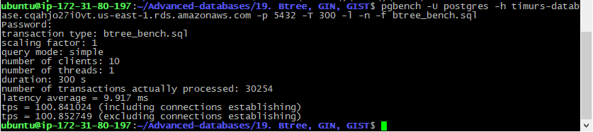
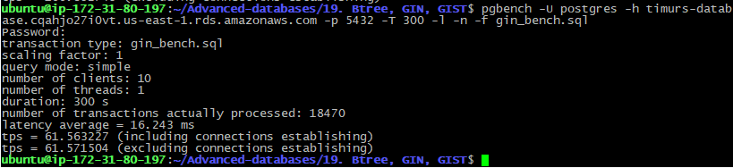
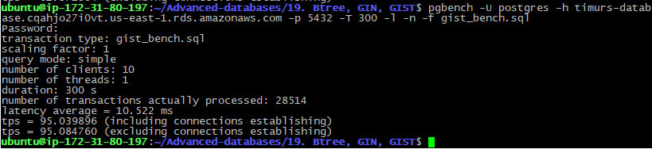

# 16. Btree Index Usage
 
 ### flyway script
 + [V9.1__LAB19_create_tables.sql](../flyway-6.4.1/sql/V9.1__LAB19_create_tables.sql)

 ### bench scripts
 + [btree_bench.sql](btree_bench.sql)
 + [gin_bench.sql](gin_bench.sql)
 + [gist_bench.sql](gist_bench.sql)
 
 ### indexes size

```sql
select pg_size_pretty( pg_indexes_size('lab19_gin'));
--  6512 kB

select pg_size_pretty( pg_indexes_size('lab19_btree'));
--  4920 kB

select pg_size_pretty( pg_indexes_size('lab19_gist'));
--  11 MB
```

### benchmarking

 
```bash
pgbench -U postgres -h timurs-database.cqahjo27i0vt.us-east-1.rds.amazonaws.com -p 5432 -T 300 -c 10 -l -n -f btree_bench.sql
``` 


```bash
pgbench -U postgres -h timurs-database.cqahjo27i0vt.us-east-1.rds.amazonaws.com -p 5432 -T 300 -c 10 -l -n -f gin_bench.sql
``` 


```bash
pgbench -U postgres -h timurs-database.cqahjo27i0vt.us-east-1.rds.amazonaws.com -p 5432 -T 300 -c 10 -l -n -f gist_bench.sql
```


### Вывод

| index | size      | latency | tps |
|:-----:|:--------:|:---:|:---:|
| btree | 6512 kB | 9.917 ms | 100 |
| gin   | 4920 kB | 16.243 ms| 62  |
| gist  | 11 MB   | 10.522 ms| 95 |
