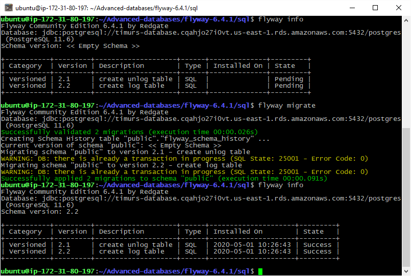
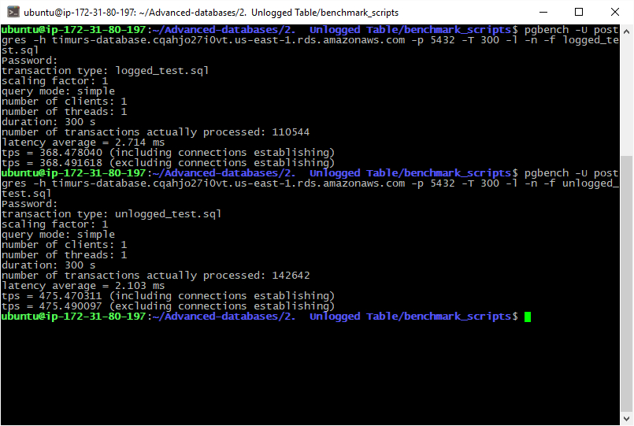
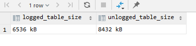

# 2. Unlogged Table

### flyway scripts
+ [V2.1__create_unlog_table.sql](../flyway-6.4.1/sql/V2.1__create_unlog_table.sql)
+ [V2.2__create_log_table.sql](../flyway-6.4.1/sql/V2.2__create_log_table.sql)

### benchmark scripts
+ [logged_test.sql](benchmark_scripts/logged_test.sql)
+ [unlogged_test.sql](benchmark_scripts/unlogged_test.sql)

### flyway migration



##### Вопросы
+ При миграции возникли варнинги. Правильно я понимаю что flyway хочет сказать, что оборачивать мою миграцию в транзакцию не имеет смысла, потому что flyway это делает сам? 
+ Если да, то имеет ли смысл использовать транзакции при миграции?

### benchmarking

```bash
pgbench -U postgres -h timurs-database.cqahjo27i0vt.us-east-1.rds.amazonaws.com -p 5432 -T 300 -l -n -f logged_test.sql
pgbench -U postgres -h timurs-database.cqahjo27i0vt.us-east-1.rds.amazonaws.com -p 5432 -T 300 -l -n -f unlogged_test.sql
```



```sql
SELECT
(SELECT pg_size_pretty(pg_total_relation_size('logged_table'))) as logged_table_size,
(SELECT pg_size_pretty(pg_total_relation_size('unlogged_table'))) as unlogged_table_size;
```



### Вывод

| | logged | unlogged |
|:---:|:---:|:---:|
| **size** | 6536 kB | 8432 kB |
| **data** | 110544 | 142642 |
| **tps** | 368.49 | 475.49 |
| **latency** | 2.714 ms | 2.103 ms |

##### Percentage of difference for INSERT between logged/unlogged tables:
+ **TPS:** 1.29
+ **latency:** 1.29


Unlogged таблица быстрее втавляет данные чем logged таблица.

# Bulk Update

| | logged | unlogged |
|:---:|:---:|:---:|
| **tps** | 368.49 | 475.49 |
| **latency** | 2.714 ms | 2.103 ms |

##### Percentage of difference for INSERT between logged/unlogged tables:
+ **TPS:** 1.29
+ **latency:** 1.29


