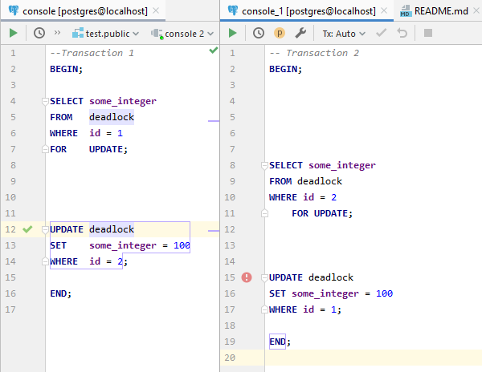
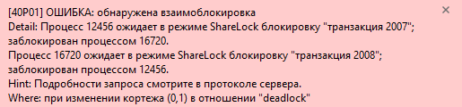
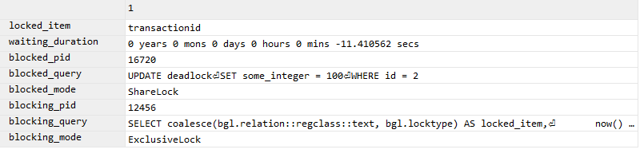

# 20. Lock Monitoring

```sql
CREATE TABLE deadlock (
    id BIGINT,
    some_integer INT
);

INSERT INTO deadlock VALUES (1, 2323);
INSERT INTO deadlock VALUES (2, 2324);
SET deadlock_timeout='30s';
```

### Making deadlock situation



### Deadlock monitoring

```sql
SELECT coalesce(bgl.relation::regclass::text, bgl.locktype) AS locked_item,
       now() - bda.query_start                              AS waiting_duration,
       bda.pid                                              AS blocked_pid,
       bda.query                                            AS blocked_query,
       bdl.mode                                             AS blocked_mode,
       bga.pid                                              AS blocking_pid,
       bga.query                                            AS blocking_query,
       bgl.mode                                             AS blocking_mode
FROM pg_locks bdl
         JOIN pg_stat_activity bda ON bda.pid = bdl.pid
         JOIN pg_catalog.pg_locks bgl ON bgl.pid != bdl.pid
    AND (bgl.transactionid = bdl.transactionid
        OR bgl.relation = bdl.relation
             AND bgl.locktype = bdl.locktype)
         JOIN pg_stat_activity bga ON bga.pid = bgl.pid AND bga.datid = bda.datid
WHERE NOT bdl.granted
  AND bga.datname = current_database();
```




#### PS
Скриншоты были сделаны с разных попыток, поэтому id могут не совпадать.