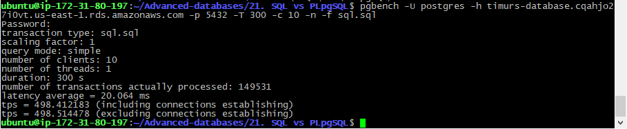
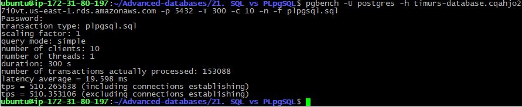

# 21. SQL vs PLpgSQL

 ### flyway script
 + [V18.1__LAB21_recreate_functions.sql](../flyway-6.4.1/sql/V18.1__LAB21_recreate_functions.sql)
 
 ### bench scripts
 + [sql.sql](sql.sql)
 + [plpgsql.sql](plpgsql.sql)
 
### benchmarking

```bash
pgbench -U postgres -h timurs-database.cqahjo27i0vt.us-east-1.rds.amazonaws.com -p 5432 -T 300 -c 10 -n -f sql.sql
``` 



```bash
pgbench -U postgres -h timurs-database.cqahjo27i0vt.us-east-1.rds.amazonaws.com -p 5432 -T 300 -c 10 -n -f plpgsql.sql
``` 




| language | latency | tps |
|:-----:|:--------:|:---:|
| sql |  20 ms | 498 |
| plpgsql   |  19.6 ms| 510  |
