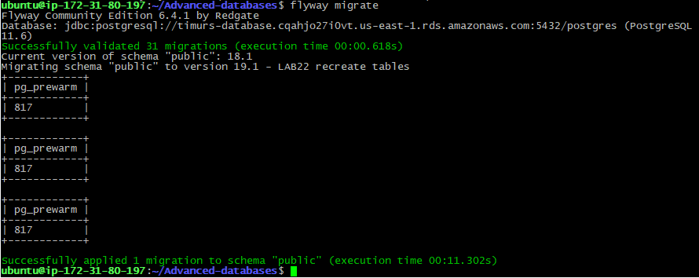
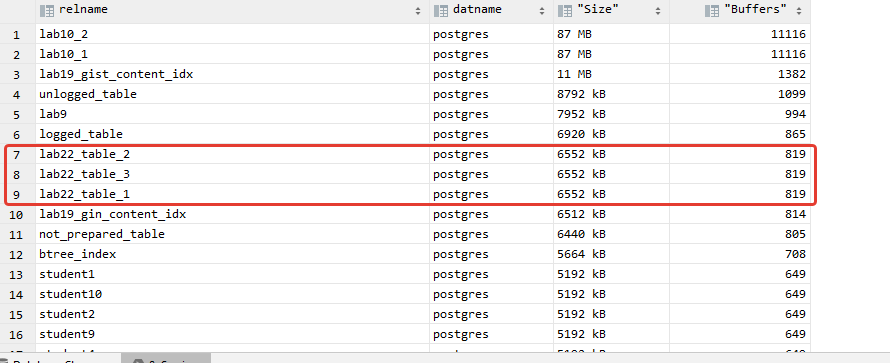

# 22. Shared Buffers

 ### flyway script
 + [V19.1__LAB22_recreate_tables.sql](../flyway-6.4.1/sql/V19.1__LAB22_recreate_tables.sql)
 


```sql
CREATE EXTENSION pg_buffercache;

SELECT c.relname,
       d.datname,
       pg_size_pretty(count(*) *
                      current_setting(‘block_size’)::INTEGER) AS "Size",
       count(*)                                               AS "Buffers"
FROM pg_buffercache b
         INNER JOIN pg_class c
                    ON b.relfilenode = pg_relation_filenode(c.oid)
         INNER JOIN pg_database d
                    ON b.reldatabase = d.oid
GROUP BY c.relname, d.datname
ORDER BY 4 DESC;
```



