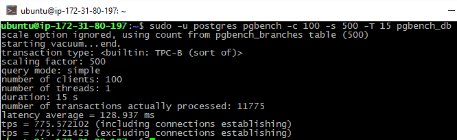

# PgBadger

#### Preparing DB for TBC-B test 

#### Executing TBC-B test 

#### pgBadger report

+ [remote on EC2](http://ec2-54-152-89-25.compute-1.amazonaws.com/out.html)
+ [saved html in rep](pgBadger_out.html)

#### Place for my explanation

