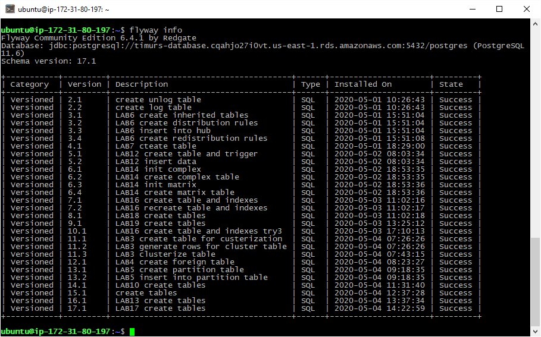

# Advanced databases
 Tasks for DataLab, ITIS

+ **1.1** [Toast strategies](01.1%20Toast%20strategies)
+ **1.2** [Fillfactor](01.2%20Fillfactor)
+ **02\.** [Unlogged Table](02.%20Unlogged%20Table)
+ **03\.** [Clustered Table](03.%20Clustered%20Table)
+ **04\.** [Foreign Table](04.%20Foreign%20Table)
+ **05\.** [Partitioned Table](05.%20Partitioned%20Table)
+ **06\.** [Inherited Table](06.%20Inherited%20Table)
+ **07\.** [VACUUM](07.%20VACUUM)
+ **08\.** [pgbadger](08.%20pgbadger)
+ **09\.** [pg_stat_statements](09.%20pg_stat_statements)
+ **10\.** [TPS and Alignment](10.%20TPS%20and%20Alignment)
+ **11\.** [Prepared Statement](11.%20Prepared%20Statement)
+ **12\.** [Triggers](12.%20Triggers)
+ **13\.** [Instead-of Trigger](13.%20Instead-of%20Trigger)
+ **14\.** [User aggregation](14.%20User%20aggregation)
+ **15\.** [SSL](15.%20SSL)
+ **16\.** [Btree Index Usage](16.%20Btree%20Index%20Usage)
+ **17\.** [Btree, BRIN, HASH](17.%20Btree,%20BRIN,%20HASH)
+ **18\.** [Standard , Geqo](18.%20Standard%20,%20Geqo)
+ **19\.** [Btree, GIN, GIST](19.%20Btree,%20GIN,%20GIST)

### flyway scripts
+ [flyway-6.4.1/sql](flyway-6.4.1/sql)

